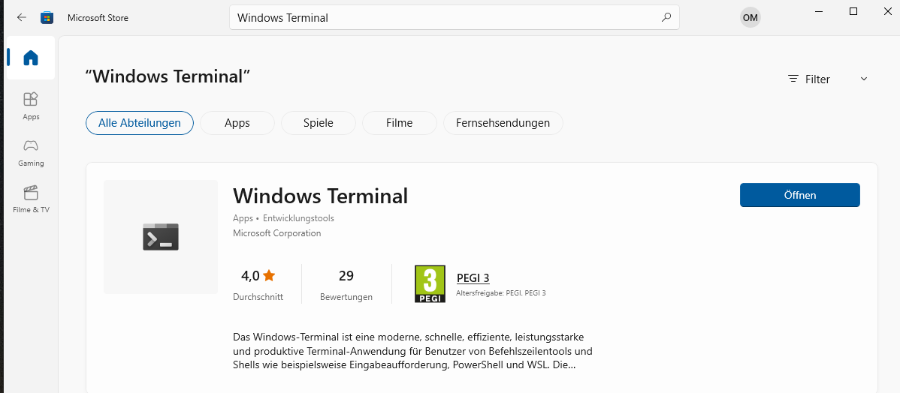
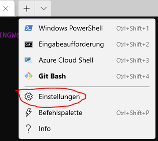
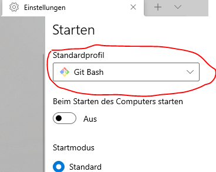

> Перепрошую зарання, деякі скруншоти на німецькій мові. Але зміст має бути зрозумілим. По змозі добавляйте Pull-реквести зі скриншотами на англійській, українській, російській.

# Terminal або Command line

Для виконання команд вам знадобиться програма, яку називають Terminal (або також Command line).

## MacOS термінал

В MacOS Термінал вже встановлений, ніяких додаткових налаштувать не потрібно. Відкрити його можна так:

1. натисніть на клавіатурі command + space.
1. напишіть "Terminal"
1. натисніть мишкою на іконку термінала.

## Windows термінал

Стандартний термінал Windows не дуже корисний. Тому потрібно буде завантажити додаткову програму. Я рекомендую Git Bash.

### Налаштування терміналу в Windows

Встановлюємо Git Bash:

1. Завантажуємо Git bash з https://gitforwindows.org/.
1. Встановлюємо його. Просто натисніть «Далі», «Далі», «Далі» та скористайтеся налаштуваннями за замовчуванням.

Налаштовуємо Windows Terminal:

1. Відкриваємо програму Microsoft Store
1. Шукаємо там "Windows Terminal":

   
1. Встановлюємо
1. Відкриваємо Windows Terminal
1. Заходимо в настройки:

   

1. Змінюємо профайл на Git Bash:

   

1. Зберігамо настройки.
1. Все готово!

### Linux термінал

Впевнений, що ви знаєте що робити. Але на провсяк випадок напишу, що Terminal можно часто в дистрибутивах визвати комбінацією клавіш Ctrl + Shift + T.